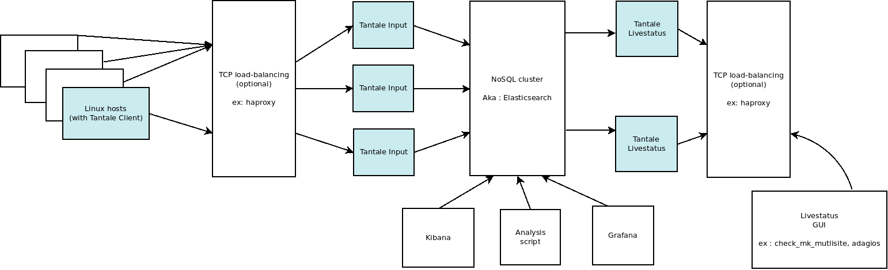
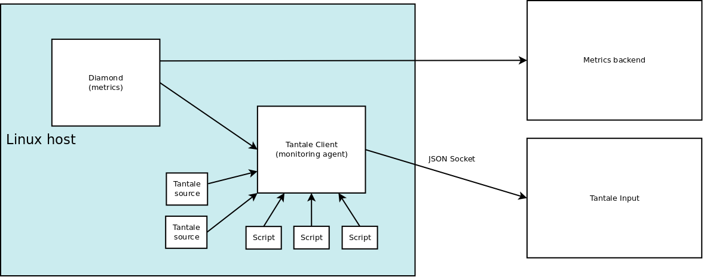

# Tantale

Tantale intend to be a monitoring tool (yet another nagios) built with simplicity, scaling and reuse in mind.

Unlike nagios, Tantale use a standard backend (NoSQL database) to store checks results and alert logs. Then, you can query monitoring data and logs from analysis scripts or dashboards.

To know cons / drawbacks of tantale, you may read :
[Why tantale ?](docs/why-tantale.md)

Tantale works with 3 **independant** modules :
  * Livestatus
  * Input
  * Client

## Tantale architecture

### Scaling / Performance

Each Input instance may handle **~ 80000 checks** per minute (according to benchmarks).

Each Livestatus instance may handle **~ 50 clients concurrent connections** (according to benchmarks).

Those numbers are tighly related to Elasticsearch cluster performance (benched on a single host).

On client side:
  * with 2 checks from each source (diamond trend on 1 metric)
  * after 1h test time 
  * 10 seconds global interval

We get:
  * no memory leak (hopefully) - around 16 MB resident memory
  * 90 seconds cpu used - 2,5% of one core - mainly forking external commands

## Modules details

Tantale start only one daemon, and activate modules by configuration. By example, you can configure a Client on a Livestatus host.

[Configuration guide](docs/configuration.md)

Elasticsearch mappings :
  * [status](src/tantale/backends/elasticsearch/status.template)
  * [status_logs](src/tantale/backends/elasticsearch/status_logs.template)

### Livestatus

Provide a livestatus API to GUI's (adagios/check-mk-multisite).

Parse query, convert to Elasticsearch query, then map back results.

>Tested clients : check-mk-multisite, (more to come)

[Details on livestatus API implementation](docs/livestatus.md)

### Input

Input handle two parts :
  * JSON Socket listener : receive, parse, group, handle status changes, batch store checks and logs into backend
  * Freshness thread : scroll current status looking outdated (hosts down), update outdated one to WARNING status (also prefix check message)

>Checks timestamp are checks execution time (on Client), not receive timestamp.

### Client

Client get data from checks source :

  * diamond

  Use local [Diamond](https://github.com/python-diamond/Diamond) daemon to get metrics. Metrics are sended to a FIFO file by FifoHandler (bundled in Tantale).

  Tantale make maths from metrics values (percentage, addition, ...) and compare to standard values (lower_crit, lower_warn, upper_warn, upper_crit).
  
  This behavior avoid process duplication.

  * ps - Processes

  Loop on local processes on a regular basis searching process regexp.

  Avoid looping on processes multiple times.

  * external

  Call users scripts 

  * ok

  Always green check. May be usefull on "Host" checks.

Client keep an internal view on all checks. Push to Tantale Input on a regular basis or triggered from a status change, problems are **immediately reported**.

Tantale sources ensure all checks are pushed to ensure new hosts checks are created. 

>TOFIX : make a way to ensure new hosts are ok (new checks will be reported if host ok, but new hosts may not appear at all)

## Inspirations

  * [Diamond](https://github.com/python-diamond/Diamond)
  * [Graphite - Carbon](https://github.com/graphite-project/carbon)
